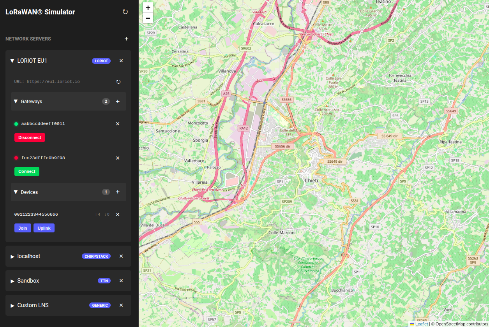
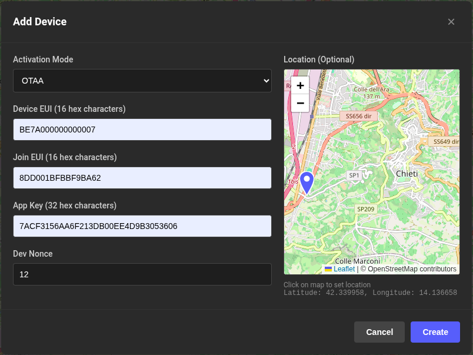
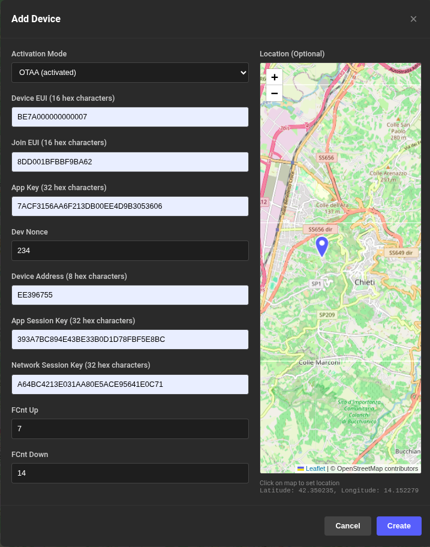
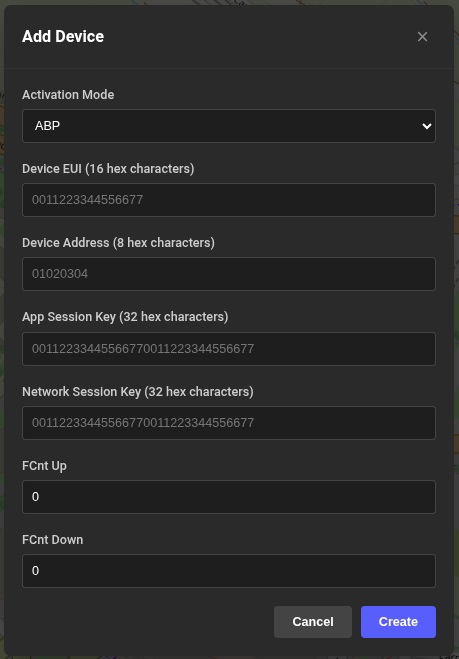
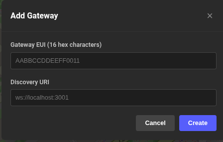

# LoRaWAN® Simulator

An open-source LoRaWAN® network simulator to simulate multiple network servers, gateways, and end devices for testing LoRaWAN® applications without physical hardware.

## Features

- ✅ **Multiple Network Servers** - Manage multiple network server instances
- ✅ **Gateway Simulation** - Simulate LoRa Basics™ Station
- ✅ **Device Simulation** - Simulate end devices with OTAA join and uplink capabilities
- ✅ **REST API** - Complete HTTP API for managing simulated entities
- ✅ **LoRaWAN® 1.0.x** - Full protocol support with encryption and MIC validation
- ✅ **Docker Support** - Easy deployment with Docker and docker compose
- ✅ **Web GUI** - Simple Vanilla JS UI for visual management

## Web Dashboard

The simulator includes a web-based dashboard for easy management of network servers, gateways, and devices:



**Features:**
- Visual status indicators (green: connected, red: disconnected, yellow: transitioning)
- Interactive map centered on your location
- Collapsible sections for organized viewing
- Real-time connection management
- One-click join and uplink operations

## Network Server Integration

When you add a network server (LORIOT, ChirpStack, or The Things Network), the simulator **automatically syncs** all gateways and devices from that network server. This means you can immediately start simulating without any manual configuration!

The synchronization:
- Fetches all gateways and devices from the network server
- Retrieves session keys and frame counters for already-activated devices
- Pulls location data for map visualization
- Keeps your simulation environment in sync with your actual network

## Manual Device Creation

If you prefer to create devices manually or need to add test devices that don't exist on your network server, the simulator provides an easy-to-use interface supporting three different activation modes:

### OTAA (Over-The-Air Activation)

Standard OTAA devices that need to perform a join procedure:



**Required fields:**
- Device EUI
- Join EUI
- App Key
- Dev Nonce (optional, defaults to 0)

### OTAA (Activated)

Pre-activated OTAA devices that already have session keys:



**Required fields:**
- Device EUI, Join EUI, App Key, Dev Nonce (OTAA credentials)
- Device Address, App Session Key, Network Session Key (session keys)
- FCnt Up, FCnt Down (frame counters)

Perfect for testing devices that have already joined or for restoring session state.

### ABP (Activation By Personalization)

ABP devices with hardcoded session keys:



**Required fields:**
- Device EUI
- Device Address
- App Session Key
- Network Session Key
- FCnt Up, FCnt Down (optional, defaults to 0)

## Manual Gateway Creation

Similarly to devices, you can manually add gateways for testing purposes:



**Required fields:**
- Gateway EUI
- Discovery URI (WebSocket endpoint for LoRa Basics™ Station protocol)

Once added, gateways can be connected/disconnected with a single click from the dashboard.

### Coming Soon

- **MAC Commands Handling** - Full support for LoRaWAN® MAC commands processing
- **Custom Radio Parameters** - Configurable spreading factor, bandwidth, and frequency settings
- **Device and Gateway Channel Plans** - Support for regional channel plans and custom configurations
- **Geolocation Broadcast** - Simulate GPS coordinates and location data
- **Class B and Class C Support** - Beyond Class A device simulation


## Quick Start

1. **Start the simulator:**

```bash
docker compose up
```

2. **Access the services:**
   - **Frontend Dashboard**: http://localhost:8022
   - **Backend API**: http://localhost:2208

## API Documentation

For complete API reference with all endpoints, parameters, and examples, see [API.md](API.md).

### Quick Example

```bash
# Create a network server
curl -X POST http://localhost:2208/network-servers \
  -H "Content-Type: application/json" \
  -d '{"name":"localhost"}'

# Add a gateway
curl -X POST http://localhost:2208/network-servers/localhost/gateways \
  -H "Content-Type: application/json" \
  -d '{
    "eui": "AABBCCDDEEFF0011",
    "discoveryUri": "ws://localhost:3001"
  }'

# Connect gateway
curl -X POST http://localhost:2208/network-servers/localhost/gateways/AABBCCDDEEFF0011/connect

# Add a device
curl -X POST http://localhost:2208/network-servers/localhost/devices \
  -H "Content-Type: application/json" \
  -d '{
    "deveui": "0011223344556677",
    "joineui": "0011223344556677",
    "appkey": "00112233445566770011223344556677",
    "devnonce": 0
  }'

# Send join request
curl -X POST http://localhost:2208/network-servers/localhost/devices/0011223344556677/join

# Send uplink data
curl -X POST http://localhost:2208/network-servers/localhost/devices/0011223344556677/uplink
```

## Console Output Examples

The simulator provides detailed logging of all message exchanges and LoRaWAN® frame processing. Here are examples from a complete test flow.

### Gateway WebSocket Connection

When a gateway connects to the network server, you'll see the WebSocket handshake:

```
[aabbccddeeff0011] discovery connected
[aabbccddeeff0011] discovery sent: {"router":"aa-bb-cc-dd-ee-ff-00-11"}
[aabbccddeeff0011] discovery response: {"router":"aabb:ccdd:eeff:0011","muxs":"aabb:ccdd:eeff:0011","uri":"ws://localhost:3001/gateway/aabbccddeeff0011"}
[aabbccddeeff0011] discovery disconnected
[aabbccddeeff0011] data connecting
[aabbccddeeff0011] data connected
[aabbccddeeff0011] data write: {"msgtype":"version","station":"lorawan-simulator","protocol":2}
```

### Router Configuration

The gateway receives configuration from the network server:

```
[aabbccddeeff0011] data read: {"msgtype":"router_config","NetID":null,"JoinEui":null,"region":"EU863","hwspec":"sx1301/1","freq_range":[863000000,870000000],...}
[aabbccddeeff0011] unknown msgtype: router_config
```

### OTAA Join Request

When a device sends a join request, you'll see the frame broadcast and WebSocket message:

```
[0011223344556677] broadcasting uplink: 00776655443322110077665544332211000000393a1d36
[pool] propagating uplink to network server localhost
[localhost] propagating uplink to gateway aabbccddeeff0011
[aabbccddeeff0011] data write: {"msgtype":"jreq","MHdr":0,"JoinEui":"00-11-22-33-44-55-66-77","DevEui":"00-11-22-33-44-55-66-77","DevNonce":0,"MIC":907885113,"DR":5,"Freq":868300000,"upinfo":{"rctx":0,"xtime":26740123065958450,"gpstime":0,"rssi":-50,"snr":9}}
```

### Uplink Data Message

When a device sends data uplink:

```
[0011223344556677] broadcasting uplink: 80f627f600a0000001010203049997a7ab
[pool] propagating uplink to network server localhost
[localhost] propagating uplink to gateway aabbccddeeff0011
[aabbccddeeff0011] data write: {"msgtype":"updf","MHdr":128,"DevAddr":16066550,"FCtrl":0,"FCnt":0,"FOpts":"","FPort":1,"FRMPayload":"9997a7ab","MIC":-1974718544,"DR":5,"Freq":868300000,"upinfo":{"rctx":0,"xtime":26740123065958450,"rssi":-50,"snr":9}}
```

### Downlink Data Message

When receiving a downlink from the network server:

```
[aabbccddeeff0011] data read: {"msgtype":"dnmsg","DevEui":"01-01-01-01-01-01-01-01" "pdu":"60f627f600a000000146fa7a872fd7053f","RxDelay":1,"RX1DR":5,"RX1Freq":868300000}
[localhost] received downlink message: 60f627f600a000000146fa7a872fd7053f
[localhost] propagating downlink to device 0101010101010101
[0101010101010101] downlink FCnt 0 - FPort: 1 - FRMPayload: 46
```

## Contributing

Contributions are welcome! Please feel free to submit issues and pull requests.

## Disclaimer

LoRaWAN® is a registered trademark of the LoRa Alliance®. This project is not affiliated with, endorsed by, or sponsored by the LoRa Alliance. This simulator is developed independently for educational and testing purposes only.

